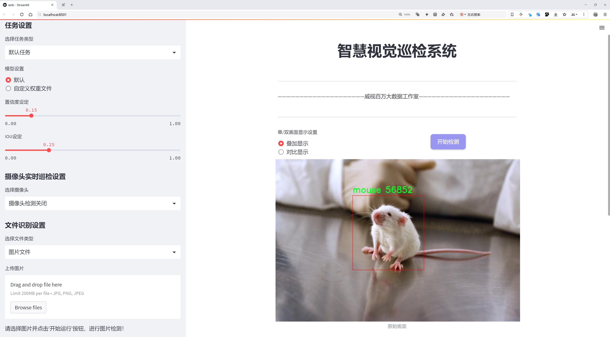
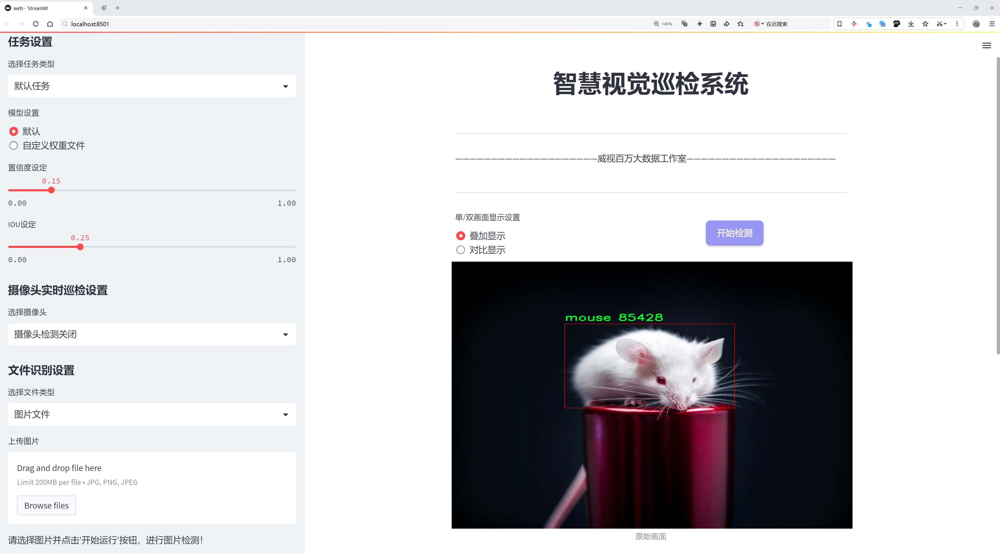
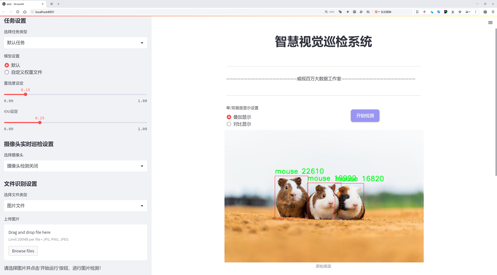
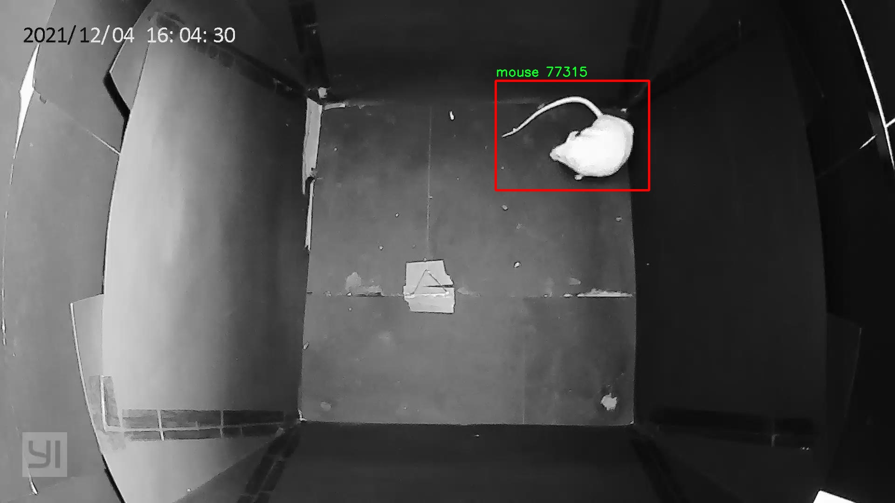
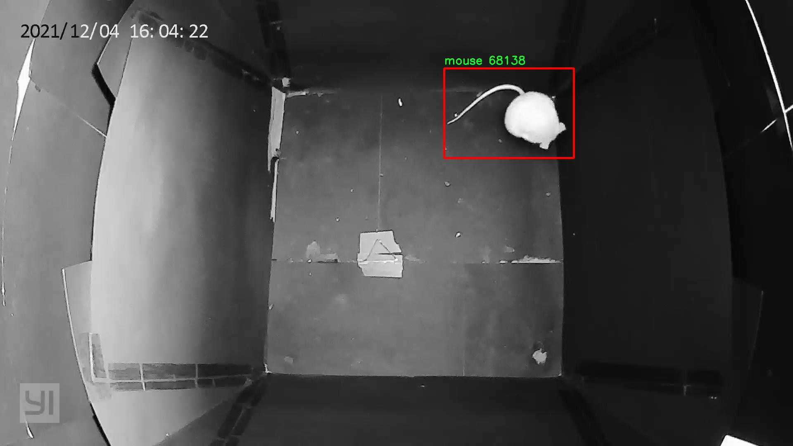
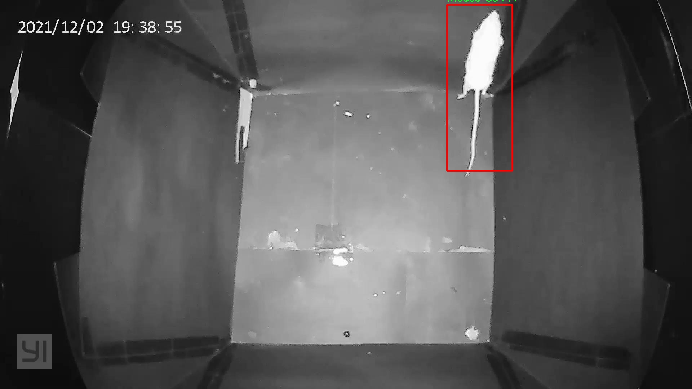
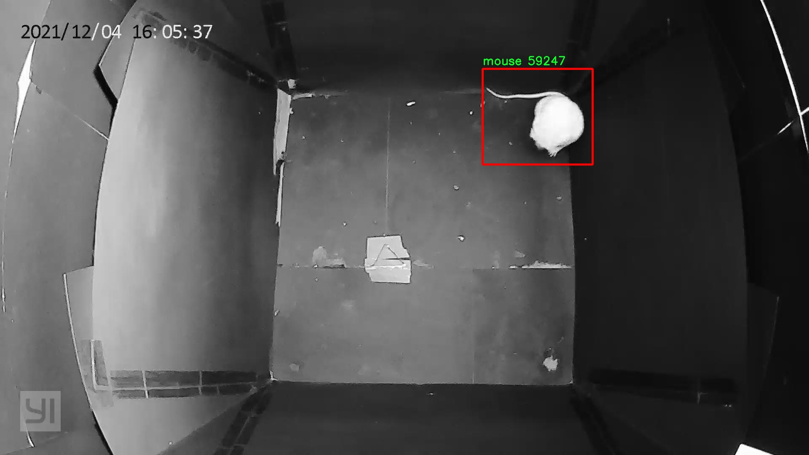
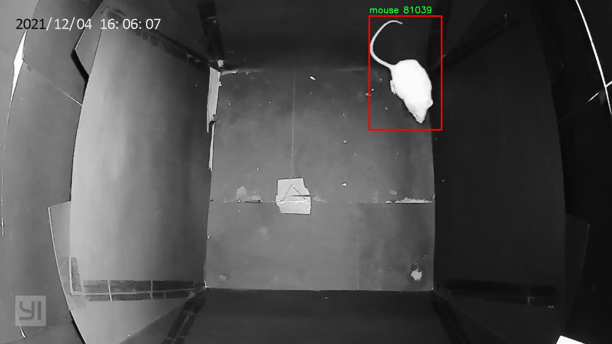

# 鼠类检测系统源码分享
 # [一条龙教学YOLOV8标注好的数据集一键训练_70+全套改进创新点发刊_Web前端展示]

### 1.研究背景与意义

项目参考[AAAI Association for the Advancement of Artificial Intelligence](https://gitee.com/qunmasj/projects)

项目来源[AACV Association for the Advancement of Computer Vision](https://kdocs.cn/l/cszuIiCKVNis)

研究背景与意义

随着城市化进程的加快，鼠类的数量不断增加，尤其是在城市和农村交界地带，鼠类对人类生活和农业生产的影响日益显著。鼠类不仅是多种疾病的传播者，还会对粮食储存和设施造成严重损害。因此，及时、准确地检测和监控鼠类的活动，对于公共卫生、农业安全及生态环境保护具有重要意义。传统的鼠类监测方法主要依赖人工观察和捕捉，这不仅效率低下，而且容易受到人为因素的影响，难以实现实时监控。近年来，计算机视觉技术的迅猛发展为鼠类检测提供了新的解决方案，尤其是基于深度学习的目标检测算法在各类物体识别任务中表现出色。

YOLO（You Only Look Once）系列算法作为一种高效的目标检测技术，因其快速的检测速度和较高的准确率而受到广泛关注。YOLOv8作为该系列的最新版本，进一步提升了模型的性能，适用于实时检测任务。然而，现有的YOLOv8模型在特定场景下的应用效果仍有待提升，尤其是在复杂环境中鼠类的检测精度和鲁棒性。因此，基于改进YOLOv8的鼠类检测系统的研究显得尤为重要。

本研究将基于dark-mice数据集进行鼠类检测系统的构建。该数据集包含2256张鼠类图像，涵盖了多种环境下的鼠类活动场景，具有较高的代表性。通过对该数据集的深入分析和模型训练，旨在优化YOLOv8算法，使其更好地适应鼠类检测的需求。研究将集中在数据增强、模型结构调整和训练策略优化等方面，以提高模型在不同光照、背景和姿态下的检测能力。

本研究的意义在于，首先，通过改进YOLOv8算法，可以实现对鼠类的高效、准确检测，为城市和农村的鼠类监控提供技术支持。其次，研究成果将为相关领域的学术研究提供参考，推动计算机视觉技术在生物监测和生态保护中的应用。此外，基于深度学习的鼠类检测系统的构建，将为未来的智能监控系统奠定基础，助力于实现自动化、智能化的生态环境管理。

综上所述，基于改进YOLOv8的鼠类检测系统的研究，不仅具有重要的理论价值，也具备广泛的应用前景。通过本研究的开展，将为鼠类监测提供新的思路和方法，为相关领域的研究和实践提供有力支持。

### 2.图片演示







##### 注意：由于此博客编辑较早，上面“2.图片演示”和“3.视频演示”展示的系统图片或者视频可能为老版本，新版本在老版本的基础上升级如下：（实际效果以升级的新版本为准）

  （1）适配了YOLOV8的“目标检测”模型和“实例分割”模型，通过加载相应的权重（.pt）文件即可自适应加载模型。

  （2）支持“图片识别”、“视频识别”、“摄像头实时识别”三种识别模式。

  （3）支持“图片识别”、“视频识别”、“摄像头实时识别”三种识别结果保存导出，解决手动导出（容易卡顿出现爆内存）存在的问题，识别完自动保存结果并导出到tempDir中。

  （4）支持Web前端系统中的标题、背景图等自定义修改，后面提供修改教程。

  另外本项目提供训练的数据集和训练教程,暂不提供权重文件（best.pt）,需要您按照教程进行训练后实现图片演示和Web前端界面演示的效果。

### 3.视频演示

[3.1 视频演示](https://www.bilibili.com/video/BV1gE2GYVErt/)

### 4.数据集信息展示

##### 4.1 本项目数据集详细数据（类别数＆类别名）

nc: 1
names: ['mouse']


##### 4.2 本项目数据集信息介绍

数据集信息展示

在本研究中，我们采用了名为“dark-mice”的数据集，以训练和改进YOLOv8模型在鼠类检测任务中的表现。该数据集专门针对鼠类的检测而设计，具有高度的针对性和实用性。通过对“dark-mice”数据集的深入分析，我们可以更好地理解其构成及其在鼠类检测系统中的重要性。

“dark-mice”数据集的类别数量为1，具体类别为“mouse”。这一单一类别的设定使得数据集在鼠类检测的任务中显得尤为集中和高效。与多类别数据集相比，单一类别的数据集能够更好地聚焦于特定目标的特征提取与学习，减少模型在训练过程中的干扰因素，从而提高检测精度。通过对鼠类的特征进行深入学习，YOLOv8模型能够在复杂环境中实现更为准确的检测和识别。

在数据集的构建过程中，研究者们对鼠类的多种形态、姿态和背景进行了细致的采集和标注。这些数据不仅包括了鼠类在自然环境中的真实图像，还涵盖了不同光照条件、不同角度以及不同背景下的鼠类图像。这种多样性确保了模型在实际应用中能够具备良好的泛化能力，能够适应各种复杂的场景。

此外，数据集中的图像经过精心挑选和处理，确保了其质量和标注的准确性。每一张图像都经过严格的审核，以确保其在训练过程中能够提供有效的信息。高质量的图像数据是训练深度学习模型的基础，能够显著提高模型的学习效率和最终的检测效果。

在使用“dark-mice”数据集进行YOLOv8模型训练时，研究者们采用了多种数据增强技术，以进一步提升模型的鲁棒性。这些技术包括随机裁剪、旋转、翻转以及颜色变换等，旨在模拟鼠类在不同环境下的出现情况，从而增强模型对鼠类的识别能力。通过这些增强手段，模型不仅能够学习到鼠类的基本特征，还能够适应不同的视觉变化，提升在实际应用中的表现。

综上所述，“dark-mice”数据集为改进YOLOv8的鼠类检测系统提供了坚实的基础。其单一类别的设计、丰富的图像样本以及高质量的标注，使得该数据集在鼠类检测任务中具有独特的优势。通过对该数据集的有效利用，我们期望能够显著提升YOLOv8模型在鼠类检测中的准确性和效率，为未来的相关研究和应用提供有力支持。











### 5.全套项目环境部署视频教程（零基础手把手教学）

[5.1 环境部署教程链接（零基础手把手教学）](https://www.ixigua.com/7404473917358506534?logTag=c807d0cbc21c0ef59de5)


[5.2 安装Python虚拟环境创建和依赖库安装视频教程链接（零基础手把手教学）](https://www.ixigua.com/7404474678003106304?logTag=1f1041108cd1f708b01a)

### 6.手把手YOLOV8训练视频教程（零基础小白有手就能学会）

[6.1 手把手YOLOV8训练视频教程（零基础小白有手就能学会）](https://www.ixigua.com/7404477157818401292?logTag=d31a2dfd1983c9668658)


按照上面的训练视频教程链接加载项目提供的数据集，运行train.py即可开始训练



     Epoch   gpu_mem       box       obj       cls    labels  img_size
     1/200     20.8G   0.01576   0.01955  0.007536        22      1280: 100%|██████████| 849/849 [14:42<00:00,  1.04s/it]
               Class     Images     Labels          P          R     mAP@.5 mAP@.5:.95: 100%|██████████| 213/213 [01:14<00:00,  2.87it/s]
                 all       3395      17314      0.994      0.957      0.0957      0.0843

     Epoch   gpu_mem       box       obj       cls    labels  img_size
     2/200     20.8G   0.01578   0.01923  0.007006        22      1280: 100%|██████████| 849/849 [14:44<00:00,  1.04s/it]
               Class     Images     Labels          P          R     mAP@.5 mAP@.5:.95: 100%|██████████| 213/213 [01:12<00:00,  2.95it/s]
                 all       3395      17314      0.996      0.956      0.0957      0.0845

     Epoch   gpu_mem       box       obj       cls    labels  img_size
     3/200     20.8G   0.01561    0.0191  0.006895        27      1280: 100%|██████████| 849/849 [10:56<00:00,  1.29it/s]
               Class     Images     Labels          P          R     mAP@.5 mAP@.5:.95: 100%|███████   | 187/213 [00:52<00:00,  4.04it/s]
                 all       3395      17314      0.996      0.957      0.0957      0.0845


### 7.70+种全套YOLOV8创新点代码加载调参视频教程（一键加载写好的改进模型的配置文件）

[7.1 70+种全套YOLOV8创新点代码加载调参视频教程（一键加载写好的改进模型的配置文件）](https://www.ixigua.com/7404478314661806627?logTag=29066f8288e3f4eea3a4)

### 8.70+种全套YOLOV8创新点原理讲解（非科班也可以轻松写刊发刊，V10版本正在科研待更新）

#### 由于篇幅限制，每个创新点的具体原理讲解就不一一展开，具体见下列网址中的创新点对应子项目的技术原理博客网址【Blog】：


[8.1 70+种全套YOLOV8创新点原理讲解链接](https://gitee.com/qunmasj/good)

#### 部分改进原理讲解(完整的改进原理见上图和技术博客链接)【如果此小节的图加载失败可以通过CSDN或者Github搜索该博客的标题访问原始博客，原始博客图片显示正常】

### YOLOv8简介
继YOLOv5之后,Ultralytics公司在2023年1月发布了YOLOv8,该版本可以用于执行目标检测、实例分割和图像分类任务。整个网络结构由4部分组成:输入图像, Backbone主干网络获得图像的特征图, Head检测头预测目标对象和位置, Neck融合不同层的特征并将图像特征传递到预测层。
1)相比于YOLOv5和 YOLOv7算法,YOLOv8在训练时间和检测精度上得到极大提升,而且模型的权重文件只有6 MB,可以部署到任一嵌入式设备中,它凭借自身快速、高效的性能可以很好地满足实时检测的需求。
2)由于YOLOv8算法是YOLOv5的继承版本，对应提供了N、S、 M、L、X 等不同尺度的模型,用于满足不同场景的需求,在精度得到大幅提升的同时,能流畅地训练,并且能安装在各种硬件平台上运行。
3)在输入端,YOLOv8算法使用了Mosaic数据增强[15]、自适应锚框计算[16]等方法。Mosaic数据增强是通过随机缩放、随机裁剪、随机排布的方式进行拼接,丰富检测数据集。自适应锚框计算是网络在初始锚框的基础上输出预测框,通过差值计算、反向更新等操作计算出最佳锚框值。
4)在输出端,YOLOv8算法使用解耦头替换了以往的耦合头,将分类和回归解耦为两个独立的分支,通过解耦使各个任务更加专注,从而解决复杂场景下定位不准及分类错误的问题。


### OREPA：在线卷积重参数化
卷积神经网络(CNNs)已经在许多计算机视觉任务的应用成功，包括图像分类、目标检测、语义分割等。精度和模型效率之间的权衡也已被广泛讨论。

一般来说，一个精度较高的模型通常需要一个更复杂的块，一个更宽或更深的结构。然而，这样的模型总是太重，无法部署，特别是在硬件性能有限、需要实时推理的场景下。考虑到效率，更小、更紧凑和更快的模型自然是首选。

为了获得一个部署友好且高精度的模型，有研究者提出了基于结构重参数化的方法来释放性能。在这些方法中，模型在训练阶段和推理阶段有不同的结构。具体来说，使用复杂的训练阶段拓扑，即重参数化的块，来提高性能。训练结束后，通过等效变换将一个复杂的块重参为成一个单一的线性层。重参后的模型通常具有一个整洁架构模型，例如，通常是一个类似VGG的或一个类似ResNet的结构。从这个角度来看，重参化策略可以在不引入额外的推理时间成本的情况下提高模型的性能。


BN层是重构模型的关键组成部分。在一个重新解析块(图1(b))中，在每个卷积层之后立即添加一个BN层。可以观察到，去除这些BN层会导致的性能退化。然而，当考虑到效率时，这种BN层的使用出乎意料地在训练阶段带来了巨大的计算开销。在推理阶段，复杂的块可以被压缩成一个卷积层。但是，在训练过程中，BN层是非线性的，也就是说，它们将特征映射除以它的标准差，这就阻止了合并整个块。因此，存在大量的中间计算操作(large FLOPS)和缓冲特征映射(high memory usage)。更糟糕的是，这么高的训练预算使得很难探索更复杂和可能更强的重参块。很自然地，下面的问题就出现了：

为什么标准化在重参中这么重要？

通过分析和实验，作者认为BN层中的尺度因子最重要，因为它们能够使不同分支的优化方向多样化。

基于观察结果，作者提出了在线重参化(OREPA)(图1(c))，这是一个两阶段的pipeline，使之能够简化复杂的training-time re-param block。

在第一阶段，block linearization，去除所有的非线性BN层，并引入线性缩放层。这些层与BN层具有相似的性质，因此它们使不同分支的优化多样化。此外，这些层都是线性的，可以在训练过程中合并成卷积层。

第二阶段，block squeezing，将复杂的线性块简化为单一的卷积层。OREPA通过减少由中间计算层引起的计算和存储开销，显著降低了训练成本，对性能只有非常小的影响。

此外，高效化使得探索更复杂的重参化拓扑成为可能。为了验证这一点，作者进一步提出了几个重参化的组件，以获得更好的性能。

在ImageNet分类任务上评估了所提出的OREPA。与最先进的修复模型相比，OREPA将额外的训练时间GPU内存成本降低了65%到75%，并将训练过程加快了1.5-2.3倍。同时，OREPA-ResNet和OREPA-VGG的性能始终优于+0.2%∼+0.6%之前的DBB和RepVGG方法。同时作者还评估了在下游任务上的OREPA，即目标检测和语义分割。作者发现OREPA可以在这些任务上也可以带来性能的提高。

提出了在线卷积重参化(OREPA)策略，这极大地提高了重参化模型的训练效率，并使探索更强的重参化块成为可能；

通过对重参化模型工作机制的分析，用引入的线性尺度层代替BN层，这仍然提供了不同的优化方向，并保持了表示能力;

在各种视觉任务上的实验表明，OREPA在准确性和训练效率方面都优于以前的重参化模型(DBB/RepVGG)。


#### 结构重参化
结构重参化最近被重视并应用于许多计算机视觉任务，如紧凑模型设计、架构搜索和剪枝。重参化意味着不同的架构可以通过参数的等价转换来相互转换。例如，1×1卷积的一个分支和3×3卷积的一个分支，可以转移到3×3卷积的单个分支中。在训练阶段，设计了多分支和多层拓扑来取代普通的线性层(如conv或全连接层)来增强模型。Cao等讨论了如何在训练过程中合并深度可分离卷积核。然后在推理过程中，将训练时间的复杂模型转移到简单模型中，以便于更快的推理。

在受益于复杂的training-time拓扑，同时，当前的重参化方法训练使用不可忽略的额外计算成本。当块变得更复杂以变得更强的表示时，GPU内存利用率和训练时间将会越来越长，最终走向不可接受。与以往的重参化方法不同，本文更多地关注训练成本。提出了一种通用的在线卷积重参化策略，使training-time的结构重参化成为可能。


#### Normalization
BN被提出来缓解训练非常深度神经网络时的梯度消失问题。人们认为BN层是非常重要的，因为它们平滑了损失。最近关于无BN神经网络的研究声称，BN层并不是不可或缺的。通过良好的初始化和适当的正则化，可以优雅地去除BN层。

对于重参化模型，作者认为重参化块中的BN层是关键的。无BN的变体将会出现性能下降。然而，BN层是非线性的，也就是说，它们将特征图除以它的标准差，这阻止了在线合并块。为了使在线重参化可行，作者去掉了重参块中的所有BN层，并引入了BN层的线性替代方法，即线性缩放层。

#### 卷积分解
标准卷积层计算比较密集，导致大的FLOPs和参数量。因此，卷积分解方法被提出，并广泛应用于移动设备的轻量化模型中。重参化方法也可以看作是卷积分解的某种形式，但它更倾向于更复杂的拓扑结构。本文的方法的不同之处在于，在kernel-level上分解卷积，而不是在structure level。

#### 在线重参化
在本节中，首先，分析了关键组件，即重参化模型中的BN层，在此基础上提出了在线重参化(OREPA)，旨在大大减少再参数化模型的训练时间预算。OREPA能够将复杂的训练时间块简化为一个卷积层，并保持了较高的精度。

OREPA的整体pipeline如图所示，它包括一个Block Linearization阶段和一个Block Squeezing阶段。


参考该博客通过分析多层和多分支结构的优化多样性，深入研究了重参化的有效性，并证明了所提出的线性缩放层和BN层具有相似的效果。

最后，随着训练预算的减少，进一步探索了更多的组件，以实现更强的重参化模型，成本略有增加。

#### 重参化中的Normalization
作者认为中间BN层是重参化过程中多层和多分支结构的关键组成部分。以SoTA模型DBB和RepVGG为例，去除这些层会导致严重的性能下降，如表1所示。


这种观察结果也得到了Ding等人的实验支持。因此，作者认为中间的BN层对于重参化模型的性能是必不可少的。

然而，中间BN层的使用带来了更高的训练预算。作者注意到，在推理阶段，重参化块中的所有中间操作都是线性的，因此可以合并成一个卷积层，从而形成一个简单的结构。

但在训练过程中，BN层是非线性的，即它们将特征映射除以其标准差。因此，中间操作应该单独计算，这将导致更高的计算和内存成本。更糟糕的是，如此高的成本将阻止探索更强大的训练模块。

#### Block Linearization
如3.1中所述，中间的BN层阻止了在训练过程中合并单独的层。然而，由于性能问题，直接删除它们并不简单。为了解决这一困境，作者引入了channel级线性尺度操作作为BN的线性替代方法。

缩放层包含一个可学习的向量，它在通道维度中缩放特征映射。线性缩放层具有与BN层相似的效果，它们都促进多分支向不同的方向进行优化，这是重参化时性能提高的关键。除了对性能的影响外，线性缩放层还可以在训练过程中进行合并，使在线重参化成为可能。


基于线性缩放层，作者修改了重参化块，如图所示。具体来说，块的线性化阶段由以下3个步骤组成：

首先，删除了所有的非线性层，即重参化块中的BN层

其次，为了保持优化的多样性，在每个分支的末尾添加了一个缩放层，这是BN的线性替代方法

最后，为了稳定训练过程，在所有分支的添加后添加一个BN层。

一旦完成线性化阶段，在重参化块中只存在线性层，这意味着可以在训练阶段合并块中的所有组件。

#### Block Squeezing
Block Squeezing步骤将计算和内存昂贵的中间特征映射上的操作转换为更经济的kernel上的操作。这意味着在计算和内存方面从减少到，其中、是特征图和卷积核的空间尺寸。

一般来说，无论线性重参化块是多么复杂，以下2个属性始终成立：

Block中的所有线性层，例如深度卷积、平均池化和所提出的线性缩放，都可以用带有相应参数的退化卷积层来表示;

Block可以由一系列并行分支表示，每个分支由一系列卷积层组成。

有了上述两个特性，如果可以将

多层（即顺序结构）

多分支（即并行结构）

简化为单一卷积，就可以压缩一个块。在下面的部分中，将展示如何简化顺序结构(图(a))和并行结构(图(b))。


### 9.系统功能展示（检测对象为举例，实际内容以本项目数据集为准）

图9.1.系统支持检测结果表格显示

  图9.2.系统支持置信度和IOU阈值手动调节

  图9.3.系统支持自定义加载权重文件best.pt(需要你通过步骤5中训练获得)

  图9.4.系统支持摄像头实时识别

  图9.5.系统支持图片识别

  图9.6.系统支持视频识别

  图9.7.系统支持识别结果文件自动保存

  图9.8.系统支持Excel导出检测结果数据


### 10.原始YOLOV8算法原理

原始YOLOV8算法原理

YOLOv8是由Ultralytics公司于2023年1月10日发布的最新版本目标检测算法，标志着YOLO系列算法在性能和效率上的又一次重大飞跃。作为YOLOv7的继任者，YOLOv8在原有架构的基础上进行了深度优化，旨在提升目标检测的精度和速度。其核心理念是通过卷积神经网络（CNN）直接在输入图像上进行目标检测与定位，避免了传统方法中滑动窗口和区域提议的复杂过程，从而实现了更高效的检测。

YOLOv8的网络结构主要由三个部分组成：Backbone、Neck和Head。Backbone部分负责特征提取，采用了一系列卷积和反卷积层，并引入了残差连接和瓶颈结构，以减小网络规模并提升性能。具体而言，Backbone使用了C2模块作为基本构成单元，结合了5个CBS模块、4个C2f模块和1个快速空间金字塔池化（SPPF）模块，形成了一个高效的特征提取网络。这种设计不仅增强了特征提取的能力，还有效降低了计算复杂度，使得YOLOv8在实时检测任务中表现出色。

在特征提取之后，Neck部分通过多尺度特征融合技术，将来自Backbone不同阶段的特征图进行整合。这一过程旨在捕捉不同尺度目标的信息，从而提升检测的鲁棒性和准确性。YOLOv8的Neck部分能够有效处理不同大小的目标，使得算法在复杂场景下仍能保持高效的检测能力。这种多尺度特征融合的设计理念使得YOLOv8在处理各种目标时具备了更强的适应性。

最后，Head部分负责最终的目标检测和分类任务。YOLOv8设有三个检测头，分别用于在不同尺寸信息下进行目标检测。每个检测头都包含了一系列卷积层和反卷积层，旨在生成高质量的检测结果。通过这种多头结构，YOLOv8能够在不同的尺度上进行目标检测，进一步提升了检测的精度和速度。

YOLOv8在算法性能上取得了显著的提升。与之前的版本相比，YOLOv8在精度（mAP）上提高了43.23%，帧率则提升了10.28倍。这一系列的改进使得YOLOv8在智能监控、自动驾驶、人脸识别等多种应用场景中表现出色，能够满足实时检测的需求。

此外，YOLOv8还引入了一些新的技术，如多尺度训练和测试、特征金字塔网络等。这些技术的结合使得YOLOv8在处理复杂场景时，能够更好地适应各种目标的变化，提高了算法的通用性和灵活性。通过对训练数据的多尺度处理，YOLOv8能够在不同的输入尺寸下保持良好的检测性能，进一步增强了模型的鲁棒性。

值得一提的是，YOLOv8还提供了五种不同的网络结构，分别为YOLOv8n、YOLOv8s、YOLOv8m、YOLOv8l和YOLOv8x。这些不同的结构在Backbone的层数和残差块的数量上有所区别，用户可以根据具体的应用需求选择合适的模型。这种灵活性使得YOLOv8能够广泛应用于各种实际场景，满足不同的性能需求。

总的来说，YOLOv8算法通过一系列创新和优化，成功提升了目标检测的精度和速度，成为了当前目标检测领域的重要工具。其深度卷积神经网络结构、有效的特征提取和融合策略，以及灵活的模型选择，使得YOLOv8在各类应用中展现出强大的能力，为目标检测技术的发展提供了新的动力。随着YOLOv8的广泛应用，未来在智能监控、自动驾驶等领域的应用前景将更加广阔。


### 11.项目核心源码讲解（再也不用担心看不懂代码逻辑）

#### 11.1 code\ultralytics\models\utils\__init__.py

当然可以！不过您提供的代码片段非常简短，仅包含了一个注释行。为了进行更深入的分析和注释，我需要更多的代码内容。请提供更多的代码片段或文件内容，以便我可以提取核心部分并进行详细注释。

这个文件是Ultralytics YOLO项目的一部分，主要用于模型相关的工具和功能的组织与导入。文件的开头包含了一个注释，表明该项目是Ultralytics YOLO，并且使用AGPL-3.0许可证。这意味着该代码是开源的，用户可以自由使用、修改和分发，但必须遵循相应的许可证条款。

由于文件内容仅包含一行注释，没有具体的代码实现，因此这个文件的主要作用是作为一个包的初始化文件。它可能会用于导入其他模块或功能，使得在使用该包时，用户可以方便地访问到相关的工具和功能。

在Python中，`__init__.py`文件通常用于标识一个目录为一个包，并可以在其中定义包的公共接口，或者执行包的初始化操作。在这个特定的文件中，虽然没有具体的实现，但它的存在表明该目录可以被视为一个模块，用户可以通过导入该模块来使用Ultralytics YOLO提供的功能。

总的来说，这个文件是Ultralytics YOLO项目的一个重要组成部分，尽管它本身没有实现具体的功能，但它为整个项目的结构和模块化提供了支持。

#### 11.2 70+种YOLOv8算法改进源码大全和调试加载训练教程（非必要）\ultralytics\utils\callbacks\base.py

以下是代码中最核心的部分，并附上详细的中文注释：

```python
from collections import defaultdict
from copy import deepcopy

# 默认回调函数字典，包含训练、验证、预测和导出过程中的各种回调函数
default_callbacks = {
    # 训练过程中的回调
    'on_pretrain_routine_start': [on_pretrain_routine_start],  # 预训练开始时调用
    'on_train_start': [on_train_start],                          # 训练开始时调用
    'on_train_epoch_start': [on_train_epoch_start],              # 每个训练周期开始时调用
    'on_train_batch_start': [on_train_batch_start],              # 每个训练批次开始时调用
    'optimizer_step': [optimizer_step],                          # 优化器更新步骤时调用
    'on_before_zero_grad': [on_before_zero_grad],                # 在梯度归零之前调用
    'on_train_batch_end': [on_train_batch_end],                  # 每个训练批次结束时调用
    'on_train_epoch_end': [on_train_epoch_end],                  # 每个训练周期结束时调用
    'on_fit_epoch_end': [on_fit_epoch_end],                      # 每个拟合周期结束时调用（训练 + 验证）
    'on_model_save': [on_model_save],                            # 模型保存时调用
    'on_train_end': [on_train_end],                              # 训练结束时调用
    'on_params_update': [on_params_update],                      # 模型参数更新时调用
    'teardown': [teardown],                                      # 训练过程结束时的清理工作

    # 验证过程中的回调
    'on_val_start': [on_val_start],                              # 验证开始时调用
    'on_val_batch_start': [on_val_batch_start],                  # 每个验证批次开始时调用
    'on_val_batch_end': [on_val_batch_end],                      # 每个验证批次结束时调用
    'on_val_end': [on_val_end],                                  # 验证结束时调用

    # 预测过程中的回调
    'on_predict_start': [on_predict_start],                      # 预测开始时调用
    'on_predict_batch_start': [on_predict_batch_start],          # 每个预测批次开始时调用
    'on_predict_batch_end': [on_predict_batch_end],              # 每个预测批次结束时调用
    'on_predict_postprocess_end': [on_predict_postprocess_end],  # 预测后处理结束时调用
    'on_predict_end': [on_predict_end],                          # 预测结束时调用

    # 导出过程中的回调
    'on_export_start': [on_export_start],                        # 模型导出开始时调用
    'on_export_end': [on_export_end]                             # 模型导出结束时调用
}

def get_default_callbacks():
    """
    返回一个包含默认回调函数的字典副本，字典的默认值为列表。

    返回:
        (defaultdict): 一个 defaultdict，包含 default_callbacks 的键和空列表作为默认值。
    """
    return defaultdict(list, deepcopy(default_callbacks))

def add_integration_callbacks(instance):
    """
    将来自不同来源的集成回调添加到实例的回调中。

    参数:
        instance (Trainer, Predictor, Validator, Exporter): 一个具有 'callbacks' 属性的对象，该属性是一个回调列表的字典。
    """
    # 加载 HUB 回调
    from .hub import callbacks as hub_cb
    callbacks_list = [hub_cb]

    # 如果实例是 Trainer 类，则加载训练相关的回调
    if 'Trainer' in instance.__class__.__name__:
        from .clearml import callbacks as clear_cb
        from .comet import callbacks as comet_cb
        from .dvc import callbacks as dvc_cb
        from .mlflow import callbacks as mlflow_cb
        from .neptune import callbacks as neptune_cb
        from .raytune import callbacks as tune_cb
        from .tensorboard import callbacks as tb_cb
        from .wb import callbacks as wb_cb
        callbacks_list.extend([clear_cb, comet_cb, dvc_cb, mlflow_cb, neptune_cb, tune_cb, tb_cb, wb_cb])

    # 将回调添加到回调字典中
    for callbacks in callbacks_list:
        for k, v in callbacks.items():
            if v not in instance.callbacks[k]:
                instance.callbacks[k].append(v)
```

### 代码说明：
1. **default_callbacks**: 这是一个字典，定义了在不同训练、验证、预测和导出阶段可以调用的回调函数。每个键对应一个特定的事件，值是一个包含回调函数的列表。

2. **get_default_callbacks**: 这个函数返回一个默认回调字典的副本，使用 `defaultdict` 来确保每个键都有一个空列表作为默认值。

3. **add_integration_callbacks**: 这个函数用于将不同来源的回调函数添加到传入的实例中。它会根据实例的类型加载相应的回调，并确保不重复添加。

这个程序文件是一个关于YOLO（You Only Look Once）算法的回调函数的基础实现，主要用于训练、验证、预测和导出模型时的不同阶段。文件中定义了一系列的回调函数，这些函数在特定的训练或验证过程中的关键时刻被调用，以便执行相应的操作或记录信息。

首先，文件中包含了一些基础的回调函数，这些函数在训练、验证和预测的不同阶段被调用。例如，`on_train_start`在训练开始时被调用，`on_train_epoch_start`在每个训练周期开始时被调用，`on_train_batch_start`在每个训练批次开始时被调用，等等。这些函数目前的实现是空的，意味着它们可以被用户根据具体需求进行扩展和实现。

接下来，文件中还定义了一些用于验证和预测的回调函数，如`on_val_start`、`on_predict_start`等。这些函数在相应的验证和预测过程的开始和结束时被调用，允许用户在这些时刻插入自定义逻辑。

此外，文件还定义了一个`default_callbacks`字典，里面包含了所有的回调函数，并将它们分类为训练、验证、预测和导出。这个字典的设计使得在实际使用时，可以方便地调用和管理这些回调函数。

`get_default_callbacks`函数返回一个包含默认回调函数的字典的副本，使用`defaultdict`来确保每个回调的默认值是一个空列表。这为后续的回调函数的添加提供了便利。

最后，`add_integration_callbacks`函数用于将来自不同来源的集成回调添加到实例的回调字典中。这个函数首先加载了一些来自不同库的回调函数，如`clearml`、`comet`、`mlflow`等，并将它们添加到相应的实例中。这使得用户可以根据需要集成多种工具和框架的回调功能，从而增强模型训练和评估的灵活性。

总体而言，这个文件为YOLO算法的训练和评估提供了一个灵活的回调机制，用户可以根据自己的需求扩展和定制这些回调函数，以实现更复杂的训练和验证逻辑。

#### 11.3 ui.py

以下是代码中最核心的部分，并附上详细的中文注释：

```python
import sys
import subprocess

def run_script(script_path):
    """
    使用当前 Python 环境运行指定的脚本。

    Args:
        script_path (str): 要运行的脚本路径

    Returns:
        None
    """
    # 获取当前 Python 解释器的路径
    python_path = sys.executable

    # 构建运行命令，使用 streamlit 运行指定的脚本
    command = f'"{python_path}" -m streamlit run "{script_path}"'

    # 执行命令，并等待其完成
    result = subprocess.run(command, shell=True)
    
    # 检查命令执行结果，如果返回码不为0，则表示执行出错
    if result.returncode != 0:
        print("脚本运行出错。")

# 实例化并运行应用
if __name__ == "__main__":
    # 指定要运行的脚本路径
    script_path = "web.py"  # 这里可以直接指定脚本名称

    # 调用函数运行脚本
    run_script(script_path)
```

### 代码注释说明：
1. **导入模块**：
   - `sys`：用于访问与 Python 解释器紧密相关的变量和函数。
   - `subprocess`：用于创建新进程、连接到它们的输入/输出/错误管道，并获得它们的返回码。

2. **定义 `run_script` 函数**：
   - 此函数接受一个参数 `script_path`，表示要运行的 Python 脚本的路径。
   - 使用 `sys.executable` 获取当前 Python 解释器的路径，以确保在正确的环境中运行脚本。
   - 构建命令字符串，使用 `streamlit` 模块运行指定的脚本。
   - 使用 `subprocess.run` 执行构建的命令，并等待其完成。
   - 检查命令的返回码，如果不为0，表示脚本运行出错，打印错误信息。

3. **主程序块**：
   - 通过 `if __name__ == "__main__":` 确保只有在直接运行该脚本时才会执行以下代码。
   - 指定要运行的脚本路径（在这里直接指定为 `"web.py"`）。
   - 调用 `run_script` 函数，传入脚本路径以执行该脚本。

这个程序文件的主要功能是使用当前的 Python 环境来运行一个指定的脚本，具体是通过 Streamlit 框架来启动一个 Web 应用。程序的结构比较简单，主要包含几个部分。

首先，程序导入了必要的模块，包括 `sys`、`os` 和 `subprocess`。`sys` 模块用于访问与 Python 解释器交互的变量和函数，`os` 模块提供了与操作系统交互的功能，而 `subprocess` 模块则用于在 Python 中执行外部命令。

接下来，程序从 `QtFusion.path` 模块中导入了 `abs_path` 函数，这个函数的作用是获取给定路径的绝对路径。

在 `run_script` 函数中，程序接受一个参数 `script_path`，这是要运行的脚本的路径。函数首先获取当前 Python 解释器的路径，并将其存储在 `python_path` 变量中。然后，程序构建了一个命令字符串，使用了 Python 的 `-m` 选项来运行 Streamlit，并指定了要运行的脚本路径。

通过 `subprocess.run` 函数，程序执行了构建好的命令。如果命令执行的返回码不为零，表示脚本运行出错，程序会输出一条错误信息。

在文件的最后部分，程序通过 `if __name__ == "__main__":` 判断是否是直接运行该脚本。如果是，程序会调用 `abs_path` 函数来获取 `web.py` 脚本的绝对路径，并将其传递给 `run_script` 函数，从而启动这个 Web 应用。

总体来说，这个程序的功能是将指定的 Python 脚本（在这里是 `web.py`）作为 Streamlit 应用运行，并处理可能出现的错误。

#### 11.4 code\ultralytics\utils\callbacks\base.py

以下是代码中最核心的部分，并附上详细的中文注释：

```python
from collections import defaultdict
from copy import deepcopy

# 默认回调函数字典，包含训练、验证、预测和导出过程中的回调函数
default_callbacks = {
    # 训练过程中的回调
    "on_pretrain_routine_start": [on_pretrain_routine_start],  # 预训练开始时调用
    "on_train_start": [on_train_start],                          # 训练开始时调用
    "on_train_epoch_start": [on_train_epoch_start],              # 每个训练周期开始时调用
    "on_train_batch_start": [on_train_batch_start],              # 每个训练批次开始时调用
    "optimizer_step": [optimizer_step],                          # 优化器更新步骤时调用
    "on_before_zero_grad": [on_before_zero_grad],                # 在梯度归零之前调用
    "on_train_batch_end": [on_train_batch_end],                  # 每个训练批次结束时调用
    "on_train_epoch_end": [on_train_epoch_end],                  # 每个训练周期结束时调用
    "on_fit_epoch_end": [on_fit_epoch_end],                      # 每个拟合周期结束时调用（训练 + 验证）
    "on_model_save": [on_model_save],                            # 模型保存时调用
    "on_train_end": [on_train_end],                              # 训练结束时调用
    "on_params_update": [on_params_update],                      # 模型参数更新时调用
    "teardown": [teardown],                                      # 训练过程结束时调用
    # 验证过程中的回调
    "on_val_start": [on_val_start],                              # 验证开始时调用
    "on_val_batch_start": [on_val_batch_start],                  # 每个验证批次开始时调用
    "on_val_batch_end": [on_val_batch_end],                      # 每个验证批次结束时调用
    "on_val_end": [on_val_end],                                  # 验证结束时调用
    # 预测过程中的回调
    "on_predict_start": [on_predict_start],                      # 预测开始时调用
    "on_predict_batch_start": [on_predict_batch_start],          # 每个预测批次开始时调用
    "on_predict_batch_end": [on_predict_batch_end],              # 每个预测批次结束时调用
    "on_predict_postprocess_end": [on_predict_postprocess_end],  # 预测后处理结束时调用
    "on_predict_end": [on_predict_end],                          # 预测结束时调用
    # 导出过程中的回调
    "on_export_start": [on_export_start],                        # 模型导出开始时调用
    "on_export_end": [on_export_end],                            # 模型导出结束时调用
}

def get_default_callbacks():
    """
    返回一个默认回调字典的副本，字典的值为默认空列表。

    返回:
        (defaultdict): 一个defaultdict，包含default_callbacks的键和空列表作为默认值。
    """
    return defaultdict(list, deepcopy(default_callbacks))

def add_integration_callbacks(instance):
    """
    将来自不同来源的集成回调添加到实例的回调字典中。

    参数:
        instance (Trainer, Predictor, Validator, Exporter): 一个对象，具有一个'callbacks'属性，该属性是一个回调列表的字典。
    """
    # 加载HUB回调
    from .hub import callbacks as hub_cb

    callbacks_list = [hub_cb]  # 初始化回调列表，包含HUB回调

    # 如果实例是Trainer类，则加载训练相关的回调
    if "Trainer" in instance.__class__.__name__:
        from .clearml import callbacks as clear_cb
        from .comet import callbacks as comet_cb
        from .dvc import callbacks as dvc_cb
        from .mlflow import callbacks as mlflow_cb
        from .neptune import callbacks as neptune_cb
        from .raytune import callbacks as tune_cb
        from .tensorboard import callbacks as tb_cb
        from .wb import callbacks as wb_cb

        # 将所有训练相关的回调添加到回调列表中
        callbacks_list.extend([clear_cb, comet_cb, dvc_cb, mlflow_cb, neptune_cb, tune_cb, tb_cb, wb_cb])

    # 将回调添加到实例的回调字典中
    for callbacks in callbacks_list:
        for k, v in callbacks.items():
            if v not in instance.callbacks[k]:  # 确保不重复添加
                instance.callbacks[k].append(v)  # 将回调添加到对应的列表中
```

### 代码说明：
1. **default_callbacks**: 定义了在训练、验证、预测和导出过程中可能调用的回调函数，便于在不同阶段执行特定的操作。
2. **get_default_callbacks**: 返回一个默认回调字典的副本，使用`defaultdict`来确保在访问不存在的键时返回空列表。
3. **add_integration_callbacks**: 该函数将来自不同库的回调函数集成到给定实例的回调字典中，以便在训练、验证和预测过程中使用。

这个程序文件是Ultralytics YOLO框架中的一个回调基类模块，主要用于定义在训练、验证、预测和导出过程中的各种回调函数。回调函数是指在特定事件发生时自动调用的函数，通常用于执行一些特定的操作，比如记录日志、调整学习率、保存模型等。

文件中首先导入了`defaultdict`和`deepcopy`，这两个模块分别用于创建一个带有默认值的字典和深拷贝对象。接下来，定义了一系列回调函数，这些函数可以在不同的训练和验证阶段被调用。每个回调函数的参数都是一个表示当前操作的对象，比如`trainer`、`validator`、`predictor`或`exporter`，这些对象代表了训练、验证、预测和导出过程中的不同角色。

具体来说，文件中包含以下几类回调函数：

1. **训练回调**：包括在预训练开始和结束、训练开始、每个训练周期和批次开始和结束时调用的函数。这些函数的实现目前为空，意味着可以根据需要进行扩展和实现具体的逻辑。

2. **验证回调**：类似于训练回调，定义了在验证开始、每个验证批次开始和结束时调用的函数。

3. **预测回调**：定义了在预测开始、每个预测批次开始和结束、后处理结束时调用的函数。

4. **导出回调**：定义了在模型导出开始和结束时调用的函数。

在文件的最后，定义了一个`default_callbacks`字典，包含了所有的回调函数，方便在实际使用中进行调用。接着，提供了一个`get_default_callbacks`函数，用于返回一个带有默认值的回调字典的深拷贝。

此外，`add_integration_callbacks`函数用于将来自不同来源的集成回调添加到给定实例的回调字典中。这个函数会根据实例的类型（如训练器、预测器等）加载相应的回调模块，并将它们添加到实例的回调列表中，以便在相应的事件发生时能够调用这些回调。

总体来说，这个模块为Ultralytics YOLO框架提供了一个灵活的回调机制，允许用户在训练和推理过程中插入自定义逻辑，以满足不同的需求。

#### 11.5 code\ultralytics\models\yolo\segment\predict.py

以下是代码中最核心的部分，并附上详细的中文注释：

```python
from ultralytics.engine.results import Results  # 导入结果处理类
from ultralytics.models.yolo.detect.predict import DetectionPredictor  # 导入检测预测器基类
from ultralytics.utils import DEFAULT_CFG, ops  # 导入默认配置和操作工具

class SegmentationPredictor(DetectionPredictor):
    """
    扩展自 DetectionPredictor 类的分割预测器类。
    用于基于分割模型进行预测。
    """

    def __init__(self, cfg=DEFAULT_CFG, overrides=None, _callbacks=None):
        """初始化 SegmentationPredictor，设置配置、覆盖参数和回调函数。"""
        super().__init__(cfg, overrides, _callbacks)  # 调用父类构造函数
        self.args.task = "segment"  # 设置任务类型为分割

    def postprocess(self, preds, img, orig_imgs):
        """对每个输入图像批次的预测结果进行后处理，包括非极大值抑制和检测结果处理。"""
        # 应用非极大值抑制，过滤掉低置信度的检测框
        p = ops.non_max_suppression(
            preds[0],  # 预测结果
            self.args.conf,  # 置信度阈值
            self.args.iou,  # IOU 阈值
            agnostic=self.args.agnostic_nms,  # 是否使用类别无关的 NMS
            max_det=self.args.max_det,  # 最大检测框数量
            nc=len(self.model.names),  # 类别数量
            classes=self.args.classes,  # 需要检测的类别
        )

        # 如果输入图像不是列表，则将其转换为 numpy 数组
        if not isinstance(orig_imgs, list):
            orig_imgs = ops.convert_torch2numpy_batch(orig_imgs)

        results = []  # 存储处理后的结果
        proto = preds[1][-1] if len(preds[1]) == 3 else preds[1]  # 获取掩膜原型

        # 遍历每个预测结果
        for i, pred in enumerate(p):
            orig_img = orig_imgs[i]  # 获取原始图像
            img_path = self.batch[0][i]  # 获取图像路径
            
            if not len(pred):  # 如果没有检测到框
                masks = None  # 掩膜设置为 None
            elif self.args.retina_masks:  # 如果使用 Retina 掩膜
                # 缩放检测框到原始图像大小
                pred[:, :4] = ops.scale_boxes(img.shape[2:], pred[:, :4], orig_img.shape)
                # 处理掩膜
                masks = ops.process_mask_native(proto[i], pred[:, 6:], pred[:, :4], orig_img.shape[:2])  # HWC
            else:  # 否则使用常规掩膜处理
                masks = ops.process_mask(proto[i], pred[:, 6:], pred[:, :4], img.shape[2:], upsample=True)  # HWC
                # 缩放检测框到原始图像大小
                pred[:, :4] = ops.scale_boxes(img.shape[2:], pred[:, :4], orig_img.shape)
            
            # 将结果存储到 results 列表中
            results.append(Results(orig_img, path=img_path, names=self.model.names, boxes=pred[:, :6], masks=masks))
        
        return results  # 返回处理后的结果列表
```

### 代码核心部分说明：
1. **类 SegmentationPredictor**：这是一个用于图像分割的预测器类，继承自 `DetectionPredictor`。
2. **初始化方法**：设置任务类型为分割，并调用父类的初始化方法。
3. **后处理方法 postprocess**：对模型的预测结果进行后处理，包括：
   - 应用非极大值抑制来过滤低置信度的检测框。
   - 处理掩膜，支持不同的掩膜处理方式。
   - 将结果存储在 `Results` 对象中，并返回处理后的结果列表。

这个程序文件是Ultralytics YOLO模型中的一个用于图像分割预测的类，名为`SegmentationPredictor`。它继承自`DetectionPredictor`类，主要用于基于分割模型进行预测。

在文件的开头，首先导入了一些必要的模块和类，包括`Results`、`DetectionPredictor`和一些工具函数`ops`。`Results`类用于存储预测结果，`DetectionPredictor`类则是进行目标检测的基础类。

`SegmentationPredictor`类的构造函数`__init__`接受三个参数：`cfg`（配置），`overrides`（覆盖配置），和`_callbacks`（回调函数）。在构造函数中，调用了父类的构造函数，并将任务类型设置为“segment”，表示这是一个分割任务。

`postprocess`方法用于对模型的预测结果进行后处理。它首先调用`ops.non_max_suppression`函数，对预测结果进行非极大值抑制，以去除冗余的检测框。该函数的参数包括置信度阈值、IOU阈值、是否使用无类别NMS、最大检测数量、类别数量和需要检测的类别。

接下来，方法检查输入的原始图像是否为列表格式，如果不是，则将其转换为NumPy数组格式。然后，初始化一个空的结果列表，并根据预测结果的结构提取出相应的掩码信息。

对于每个预测结果，方法会处理原始图像和预测框。如果没有检测到目标，掩码将被设置为`None`。如果启用了`retina_masks`选项，则使用`ops.process_mask_native`函数处理掩码；否则，使用`ops.process_mask`函数进行处理，并对预测框进行缩放，以适应原始图像的尺寸。

最后，方法将处理后的结果封装成`Results`对象，并将其添加到结果列表中。最终返回这个结果列表，包含了每张图像的原始图像、路径、类别名称、检测框和掩码信息。

总的来说，这个文件实现了一个用于图像分割的预测器，能够对输入图像进行处理并返回相应的分割结果。

#### 11.6 train.py

以下是代码中最核心的部分，并附上详细的中文注释：

```python
class DetectionTrainer(BaseTrainer):
    """
    DetectionTrainer类用于基于检测模型进行训练，继承自BaseTrainer类。
    """

    def build_dataset(self, img_path, mode="train", batch=None):
        """
        构建YOLO数据集。

        参数:
            img_path (str): 包含图像的文件夹路径。
            mode (str): 模式，可以是'train'或'val'，用户可以为每种模式自定义不同的数据增强。
            batch (int, optional): 批次大小，仅在'rect'模式下使用。默认为None。
        """
        gs = max(int(de_parallel(self.model).stride.max() if self.model else 0), 32)
        return build_yolo_dataset(self.args, img_path, batch, self.data, mode=mode, rect=mode == "val", stride=gs)

    def get_dataloader(self, dataset_path, batch_size=16, rank=0, mode="train"):
        """构造并返回数据加载器。"""
        assert mode in ["train", "val"]  # 确保模式有效
        with torch_distributed_zero_first(rank):  # 仅在DDP情况下初始化数据集*.cache一次
            dataset = self.build_dataset(dataset_path, mode, batch_size)
        shuffle = mode == "train"  # 训练模式下打乱数据
        if getattr(dataset, "rect", False) and shuffle:
            LOGGER.warning("WARNING ⚠️ 'rect=True'与DataLoader的shuffle不兼容，设置shuffle=False")
            shuffle = False
        workers = self.args.workers if mode == "train" else self.args.workers * 2  # 根据模式设置工作线程数
        return build_dataloader(dataset, batch_size, workers, shuffle, rank)  # 返回数据加载器

    def preprocess_batch(self, batch):
        """对一批图像进行预处理，包括缩放和转换为浮点数。"""
        batch["img"] = batch["img"].to(self.device, non_blocking=True).float() / 255  # 将图像转移到设备并归一化
        if self.args.multi_scale:  # 如果启用多尺度
            imgs = batch["img"]
            sz = (
                random.randrange(self.args.imgsz * 0.5, self.args.imgsz * 1.5 + self.stride)
                // self.stride
                * self.stride
            )  # 随机选择尺寸
            sf = sz / max(imgs.shape[2:])  # 计算缩放因子
            if sf != 1:
                ns = [
                    math.ceil(x * sf / self.stride) * self.stride for x in imgs.shape[2:]
                ]  # 计算新的形状
                imgs = nn.functional.interpolate(imgs, size=ns, mode="bilinear", align_corners=False)  # 进行插值
            batch["img"] = imgs  # 更新批次图像
        return batch

    def get_model(self, cfg=None, weights=None, verbose=True):
        """返回YOLO检测模型。"""
        model = DetectionModel(cfg, nc=self.data["nc"], verbose=verbose and RANK == -1)  # 创建检测模型
        if weights:
            model.load(weights)  # 加载权重
        return model

    def get_validator(self):
        """返回用于YOLO模型验证的DetectionValidator。"""
        self.loss_names = "box_loss", "cls_loss", "dfl_loss"  # 定义损失名称
        return yolo.detect.DetectionValidator(
            self.test_loader, save_dir=self.save_dir, args=copy(self.args), _callbacks=self.callbacks
        )  # 返回验证器

    def plot_training_samples(self, batch, ni):
        """绘制带有注释的训练样本。"""
        plot_images(
            images=batch["img"],
            batch_idx=batch["batch_idx"],
            cls=batch["cls"].squeeze(-1),
            bboxes=batch["bboxes"],
            paths=batch["im_file"],
            fname=self.save_dir / f"train_batch{ni}.jpg",
            on_plot=self.on_plot,
        )
```

### 代码核心部分说明：
1. **DetectionTrainer类**：用于处理YOLO模型的训练过程，继承自BaseTrainer，包含数据集构建、数据加载、模型获取等功能。
2. **build_dataset方法**：根据给定的图像路径和模式构建YOLO数据集，支持训练和验证模式。
3. **get_dataloader方法**：构造数据加载器，确保在分布式训练中只初始化一次数据集，并根据模式设置数据打乱和工作线程数。
4. **preprocess_batch方法**：对输入的图像批次进行预处理，包括归一化和多尺度调整。
5. **get_model方法**：返回YOLO检测模型，支持加载预训练权重。
6. **get_validator方法**：返回用于模型验证的验证器，定义损失名称。
7. **plot_training_samples方法**：绘制训练样本及其注释，便于可视化训练过程。

这个程序文件 `train.py` 是一个用于训练 YOLO（You Only Look Once）目标检测模型的 Python 脚本，主要依赖于 Ultralytics 提供的库。文件中定义了一个名为 `DetectionTrainer` 的类，该类继承自 `BaseTrainer`，用于实现目标检测模型的训练过程。

在类的构造函数中，首先定义了一些用于构建数据集和数据加载器的方法。`build_dataset` 方法负责构建 YOLO 数据集，接受图像路径、模式（训练或验证）和批次大小作为参数。它会根据模型的步幅计算出合适的大小，并调用 `build_yolo_dataset` 函数来创建数据集。

`get_dataloader` 方法用于构建并返回数据加载器。它会检查模式是否为训练或验证，并根据模式的不同设置数据加载器的参数，比如是否打乱数据顺序（shuffle）。在训练模式下，数据加载器会随机打乱数据，而在验证模式下则不会。

`preprocess_batch` 方法对每个批次的图像进行预处理，包括将图像缩放到合适的大小并转换为浮点数格式。它还支持多尺度训练，通过随机选择图像的大小来增强模型的鲁棒性。

`set_model_attributes` 方法用于设置模型的属性，包括类别数量和类别名称。这些信息是从数据集中提取的，并将其附加到模型中，以便在训练过程中使用。

`get_model` 方法用于返回一个 YOLO 检测模型的实例，可以选择加载预训练的权重。`get_validator` 方法返回一个用于验证模型性能的验证器。

在训练过程中，`label_loss_items` 方法用于返回带有标签的训练损失项字典，以便于监控训练过程中的损失变化。`progress_string` 方法返回一个格式化的字符串，显示训练进度，包括当前的 epoch、GPU 内存使用情况、损失值、实例数量和图像大小。

此外，`plot_training_samples` 方法用于绘制训练样本及其标注，便于可视化训练数据的质量。`plot_metrics` 和 `plot_training_labels` 方法则用于绘制训练过程中的各种指标和标签，以便分析模型的训练效果。

总体来说，这个文件实现了 YOLO 模型训练的各个方面，包括数据集构建、数据加载、模型设置、损失计算和结果可视化等，提供了一个完整的训练框架。

### 12.系统整体结构（节选）

### 整体功能和构架概括

该项目是一个基于Ultralytics YOLO（You Only Look Once）框架的目标检测和图像分割模型的实现，旨在提供一个完整的训练、验证和推理流程。项目的核心功能包括数据集的构建与加载、模型的训练与评估、预测结果的处理与可视化，以及回调机制的实现。整体架构通过模块化设计，使得各个功能模块之间相对独立，便于维护和扩展。

以下是项目中各个文件的功能整理：

| 文件路径                                                                                      | 功能描述                                                                                           |
|-----------------------------------------------------------------------------------------------|----------------------------------------------------------------------------------------------------|
| `code\ultralytics\models\utils\__init__.py`                                                  | 初始化模块，组织模型相关的工具和功能，提供包的公共接口。                                           |
| `70+种YOLOv8算法改进源码大全和调试加载训练教程（非必要）\ultralytics\utils\callbacks\base.py` | 定义训练、验证、预测和导出过程中的回调函数，提供灵活的回调机制以支持自定义逻辑。                   |
| `ui.py`                                                                                       | 启动一个基于Streamlit的Web应用，用于运行指定的Python脚本。                                        |
| `code\ultralytics\utils\callbacks\base.py`                                                  | （重复文件路径）定义训练、验证、预测和导出过程中的回调函数，提供灵活的回调机制以支持自定义逻辑。 |
| `code\ultralytics\models\yolo\segment\predict.py`                                           | 实现图像分割预测器，处理输入图像并返回分割结果。                                                  |
| `train.py`                                                                                    | 实现YOLO模型的训练过程，包括数据集构建、数据加载、模型设置、损失计算和结果可视化等。              |
| `code\ultralytics\solutions\distance_calculation.py`                                         | 提供距离计算的相关功能，可能用于目标检测或跟踪任务中的距离测量。                                   |
| `70+种YOLOv8算法改进源码大全和调试加载训练教程（非必要）\ultralytics\utils\__init__.py`      | 初始化模块，组织工具和功能，提供包的公共接口。                                                     |
| `70+种YOLOv8算法改进源码大全和调试加载训练教程（非必要）\ultralytics\trackers\utils\__init__.py` | 初始化模块，组织跟踪相关的工具和功能，提供包的公共接口。                                          |
| `70+种YOLOv8算法改进源码大全和调试加载训练教程（非必要）\ultralytics\models\yolo\detect\predict.py` | 实现目标检测预测器，处理输入图像并返回检测结果。                                                  |
| `code\ultralytics\utils\metrics.py`                                                          | 提供用于评估模型性能的各种指标计算功能，如精度、召回率等。                                         |
| `code\ultralytics\utils\autobatch.py`                                                       | 实现自动批处理功能，根据可用的GPU内存动态调整批次大小。                                           |
| `70+种YOLOv8算法改进源码大全和调试加载训练教程（非必要）\ultralytics\models\utils\ops.py`      | 提供模型操作的相关功能，如非极大值抑制、掩码处理等。                                              |

这个表格总结了项目中各个文件的主要功能，展示了项目的模块化设计和各个组件之间的关系。

注意：由于此博客编辑较早，上面“11.项目核心源码讲解（再也不用担心看不懂代码逻辑）”中部分代码可能会优化升级，仅供参考学习，完整“训练源码”、“Web前端界面”和“70+种创新点源码”以“13.完整训练+Web前端界面+70+种创新点源码、数据集获取”的内容为准。

### 13.完整训练+Web前端界面+70+种创新点源码、数据集获取


# [下载链接：https://mbd.pub/o/bread/ZpyYmp9v](https://mbd.pub/o/bread/ZpyYmp9v)